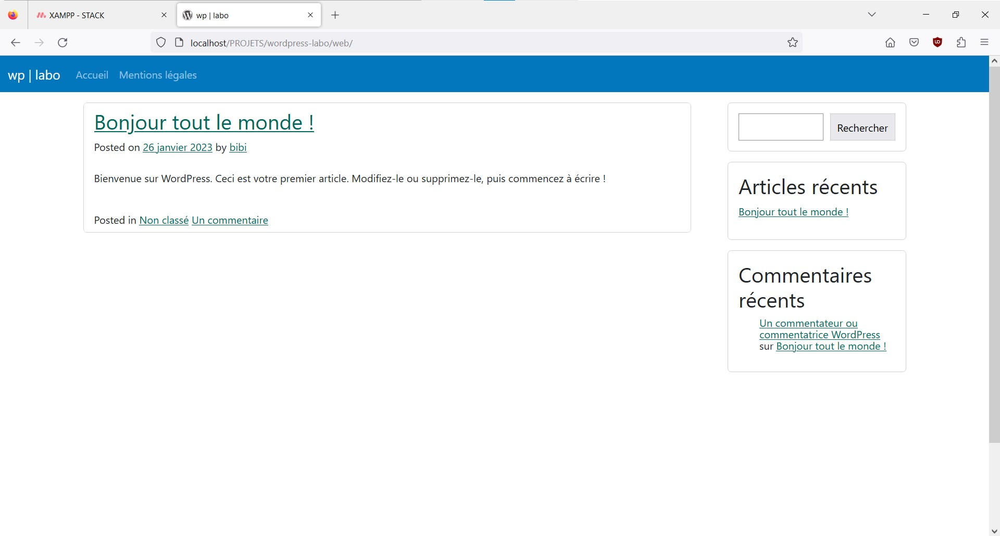

# Underscore Bootstrap

> **Project description**: Integration of the css framework [bootstrap](https://getbootstrap.com/) in the starter theme [Underscores](https://underscores.me/).

## Installation

## Usage

## Contributing
[makeareadme](https://www.makeareadme.com/)

## License
[Unlicense](https://choosealicense.com/licenses/unlicense/)
